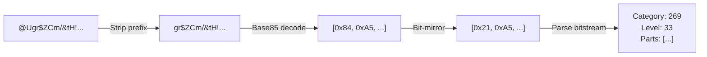

# Chapter 5: Item Serials {#sec-item-serials}

The first time you see an item serial—something like `@Ugr$ZCm/&tH!t{KgK/Shxu>k`—it looks like line noise. Random characters that couldn't possibly mean anything. But that string contains a complete weapon: its manufacturer, every part attached to it, the level, the random seed that determined its stats. Everything needed to reconstruct the item perfectly.

This chapter decodes how serials work. By the end, you'll understand every transformation from that cryptic string to a fully-described weapon.

---

## What's Encoded in a Serial

A serial is self-contained. Given just the string, the game can reconstruct the item completely—no external references needed. If you copy a serial from one save file into another, the recipient gets an exact duplicate of the weapon. This is an internal encoding detail, not something the game exposes to players, but understanding it is what makes save editing and item analysis possible.

Inside that string:
- Item type (weapon, shield, class mod)
- Manufacturer
- Level
- Element type (Kinetic, Corrosive, Shock, Radiation, Cryo, Fire)
- Every part (barrel, grip, scope, magazine)
- Random seed for stat calculations
- Additional flags (some correlate with rarity in database)

The encoding is compact. A 40-character serial describes an item that would need hundreds of bytes in a more verbose format.

---

## The Decoding Pipeline

Serials transform through multiple stages. Understanding each stage reveals how the pieces fit together.



The prefix `@U` marks this as a BL4 serial. After stripping the two-character prefix, everything else is Base85-encoded binary data. The character at position 3 (the first Base85 character) varies based on the magnitude of the first encoded value—it is NOT a type discriminator, despite appearing to correlate with item types at first glance.

---

## Base85: Custom Alphabet

BL4 doesn't use standard ASCII85. It uses a custom 85-character alphabet:

```text
0123456789ABCDEFGHIJKLMNOPQRSTUVWXYZabcdefghijklmnopqrstuvwxyz!#$%&()*+-;<=>?@^_`{/}~
```

Every 5 characters encode 4 bytes. The math: 85⁵ ≈ 4.4 billion, which fits in 32 bits (4 bytes) with room to spare.

To decode, look up each character's position in the alphabet, combine them as a base-85 number, then extract 4 bytes big-endian:

```text
Characters: g r $ Z C
Positions:  42 53 64 35 12

Value = 42×85⁴ + 53×85³ + 64×85² + 35×85 + 12
      = 2,225,440,262

Bytes: [0x84, 0xA5, 0x86, 0x06]
```

---

## Bit Mirroring: The Obfuscation Layer

After Base85 decoding, each byte gets bit-reversed. 0x87 (binary `10000111`) becomes 0xE1 (binary `11100001`).

```rust
fn mirror_byte(b: u8) -> u8 {
    let mut result = 0;
    for i in 0..8 {
        if (b >> i) & 1 == 1 {
            result |= 1 << (7 - i);
        }
    }
    result
}
```

---

## Bit Assembly: MSB Stream, LSB Data

After mirroring, the bytes form a bitstream that's read MSB-first (bit 7 of each byte first). But data values within the stream are encoded LSB-first — the first bit read is the least significant bit of the value.

This means framing bits (prefixes, continuation flags, magic header) work correctly as-is, but multi-bit data values must have their bits reversed after reading. Each VarInt nibble (4 bits) and each VarBit length/value field gets its bits reversed within its width.

For example, reading 4 bits that come out as `1000` (8) from the stream actually represents the value `0001` (1) after reversal. This reversal is applied per-nibble for VarInts and per-field for VarBits.

---

## Token Parsing: The Real Structure

The first 7 bits must be `0010000` (0x10)—a magic number validating this as a proper serial.

After the magic header, the stream contains tokens identified by prefix bits:

| Prefix | Token Type | Purpose |
|--------|------------|---------|
| `00` | Separator | Hard boundary between sections |
| `01` | SoftSeparator | Softer boundary (like commas) |
| `100` | VarInt | Variable-length integer |
| `101` | Part | Part reference with optional value |
| `110` | VarBit | Bit-length-prefixed integer |
| `111` | String | Length-prefixed ASCII string |

**VarInt** encodes integers in nibbles (4-bit chunks). Each nibble has 4 bits of value plus 1 continuation bit. Keep reading nibbles until the continuation bit is 0. Each nibble's bits are reversed after reading (MSB stream → LSB data).

**VarBit** starts with a 5-bit length (reversed), then that many bits of data (also reversed). More efficient for known-size values.

**Part** tokens reference parts by index, optionally with associated values. `{42}` means part index 42, `{42:7}` means part 42 with value 7.

---

## Item Type: Determined by First Token

The **actual item type** is determined by parsing the first token after the magic header:

| First Token | Item Type | What It Contains |
|-------------|-----------|------------------|
| VarInt (prefix `100`) | Weapon | Pistols, shotguns, rifles, SMGs, snipers |
| VarBit (prefix `110`) | Equipment | Shields, grenades, class mods, gadgets |

This means two serials with different third characters might represent the same category of item. Always determine type from the bitstream, not the character.

## Two Serial Formats

BL4 uses two distinct token structures, distinguished by the first token after the 7-bit magic header:

### Weapon Format (VarInt-first)

Weapons start with a VarInt encoding a combined manufacturer/weapon-type ID:

```text
[0] VarInt: manufacturer_weapon_id   (e.g., 4 = Jakobs Pistol, 22 = Ripper SMG)
[1] SoftSeparator
[2] VarInt: 0
[3] SoftSeparator
[4] VarInt: 1
[5] SoftSeparator
[6] VarInt: level_code               <- LEVEL ENCODED HERE
[7] Separator
[8] VarInt: 2
[9] SoftSeparator
[10] VarInt: seed                    <- Random seed for stats
[11] Separator
[12] Separator
[13+] Part tokens...
```

### Equipment Format (VarBit-first)

Equipment (shields, grenades, class mods) starts with a VarBit encoding the category:

```text
[0] VarBit: category_id              <- Category ID directly
[1] SoftSeparator
[2] VarInt: 0
[3] SoftSeparator
[4] VarInt: 1
[5] SoftSeparator
[6] VarInt: level_code               <- LEVEL ENCODED HERE
[7] Separator
[8] VarInt: seed
[9] SoftSeparator
[10] VarInt: (varies)
[11+] More data and parts...
```

For VarBit-first serials, the VarBit value IS the NCS category ID directly. No divisor or formula is needed.

---

## Part Group IDs (Categories)

The Part Group ID (also called Category ID) determines which part pool to use for decoding. Each ID corresponds to a manufacturer/weapon-type combination.

For weapons, the first VarInt (serial ID) maps directly to the NCS category. The bl4 tools handle this via `serial_id_to_parts_category()`, but for most weapons the serial ID matches the NCS category.

**Pistols (2-6):**

| ID | Manufacturer | Code |
|----|--------------|------|
| 2 | Daedalus | DAD_PS |
| 3 | Jakobs | JAK_PS |
| 4 | Order | ORD_PS |
| 5 | Tediore | TED_PS |
| 6 | Torgue | TOR_PS |

**Shotguns (7-12):**

| ID | Manufacturer | Code |
|----|--------------|------|
| 7 | Ripper | BOR_SG |
| 8 | Daedalus | DAD_SG |
| 9 | Jakobs | JAK_SG |
| 10 | Maliwan | MAL_SG |
| 11 | Tediore | TED_SG |
| 12 | Torgue | TOR_SG |

**Assault Rifles (13-18, 27):**

| ID | Manufacturer | Code |
|----|--------------|------|
| 13 | Daedalus | DAD_AR |
| 14 | Tediore | TED_AR |
| 15 | Order | ORD_AR |
| 17 | Torgue | TOR_AR |
| 18 | Vladof | VLA_AR |
| 27 | Jakobs | JAK_AR |

**Snipers (16, 23-26):**

| ID | Manufacturer | Code |
|----|--------------|------|
| 16 | Vladof | VLA_SR |
| 23 | Ripper | BOR_SR |
| 24 | Jakobs | JAK_SR |
| 25 | Maliwan | MAL_SR |
| 26 | Order | ORD_SR |

**SMGs (19-22):**

| ID | Manufacturer | Code |
|----|--------------|------|
| 19 | Ripper | BOR_SM |
| 20 | Daedalus | DAD_SM |
| 21 | Maliwan | MAL_SM |
| 22 | Vladof | VLA_SM |

---

## Part Indices Are Context-Dependent

Part token `{4}` doesn't mean the same part across all weapons. The index is relative to the Part Group. Index 4 on a Vladof SMG might be a specific barrel, while index 4 on a Jakobs Pistol is something completely different.

This is why you must decode the Part Group ID first. Without knowing which pool you're indexing into, part tokens are meaningless.

---

## Level Encoding

Level is encoded as a VarInt at position 6 in the token list for both weapon and equipment formats. The VarInt value is the level directly (e.g., 50 = level 50).

---

## Element Encoding

Element types are encoded as Part tokens. The element part index maps to the element type through the parts database — element parts have names like `Kinetic`, `Corrosive`, `Fire`, etc.

Multi-element weapons contain multiple element part tokens:
```text
Parts: ... Corrosive, Kinetic, Radiation ...  → Three elements
```

---

## Decoding a Serial Manually

Let's walk through `@Ugr$ZCm/&tH!t{KgK/Shxu>k`:

**Step 1: Structure**
- Prefix: `@U` (stripped)
- Base85 data: `gr$ZCm/&tH!...`

**Step 2: Base85 decode**
First 5 characters `gr$ZC`:
- Positions: 42, 53, 64, 35, 12
- Value: 2,225,440,262
- Bytes: [0x84, 0xA5, 0x86, 0x06]

Continue for remaining characters.

**Step 3: Bit-mirror each byte**
```text
Original: 84 A5 86 06 ...
Mirrored: 21 A5 61 60 ...
```

**Step 4: Parse bitstream**
```text
Binary: 00100001 10100101 01100001 ...
        └──────┘ └────────────────...
         Magic   Tokens begin
         (0x10)
```

First token after magic: prefix `110` = VarBit
- 5-bit length (reversed): 9
- 9 bits of data (reversed): 269

Category = 269 (Vladof Repair Kit)

The bl4 tool handles all this:
```bash
bl4 serial decode '@Ugr$ZCm/&tH!t{KgK/Shxu>k'
# Vladof Repair Kit (269) ✓
# Level: 33
```

---

## Decoding Examples

### Weapon Serial

Serial: `@UgxFw!2}TYgOs)+YRG}7?s3AisQ8!UBQ8Q6BQDIPXP<2qdQ2P)`

Decoded tokens:
```text
22 ,  0 ,  1 ,  50 | 2 ,  3417 | | {1} {2} {5} {4} {1:12} {68} {75} {72} {73} {74} {16} {25} {26} {45} {61}
```

- First VarInt (22): Ripper SMG
- 4th VarInt (50): Level 50
- Seed (3417): Random seed after first separator
- Part tokens resolve to barrels, body parts, grips, elements, and legendary composition

### Equipment Serial

Serial: `@Ugr%Scm/)}}$pj({qzigfrP>z<v^$y<L5*r(1po`

Decoded tokens:
```text
321 ,  0 ,  1 ,  50 | 9 ,  1 | 2 ,  2880 | | {7} {10} {246:24} {237} ,  9 2 | {6} {246:10}
```

- First VarBit (321): Torgue Shield
- Level: 50
- Part tokens: legendary rarity component, body armor, stat modifiers, unique legendary part

---

## Exercises

**Exercise 1: Identify Item Types**

Given these serials, what category is each?
1. `@Uge8aum/(OZ$pj+I_5#Y(pw{;WbgA{xWRhC/`
2. `@UgxFw!2}TYgOs)+YRG}7?s3AisQ8!UBQ8Q6BQDIPXP<2qdQ2P)`
3. `@Ugr%Scm/)}}$pj({qzigfrP>z<v^$y<L5*r(1po`

**Exercise 2: Decode a Manufacturer**

Use `bl4 serial decode` on a weapon serial. What Part Group ID does it use? What manufacturer does that correspond to?

**Exercise 3: Compare Two Items**

Find two similar weapons in your inventory. Decode both serials. Which tokens differ? Can you correlate the differences to visible stats?

<details>
<summary>Exercise 1 Answers</summary>

Decode each serial with `bl4 serial decode`:

1. First token is VarBit (272) → Order Grenade Gadget
2. First token is VarInt (22) → Ripper SMG
3. First token is VarBit (321) → Torgue Shield

</details>

---

## What's Next

Now that we understand how serials encode items, we need to understand the NCS format that stores part definitions, item pools, and loot configuration. NCS is the foundational data format that makes serial decoding meaningful.

**Next: [Chapter 6: NCS Format](#sec-ncs-format)**
