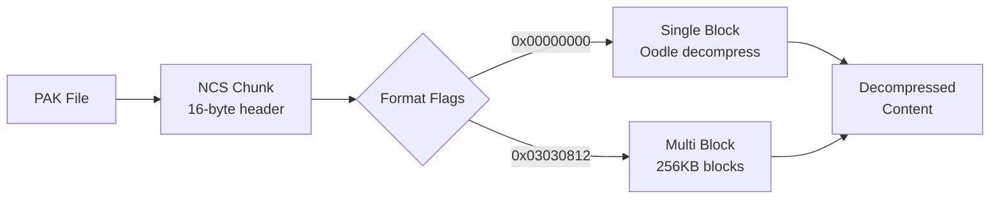
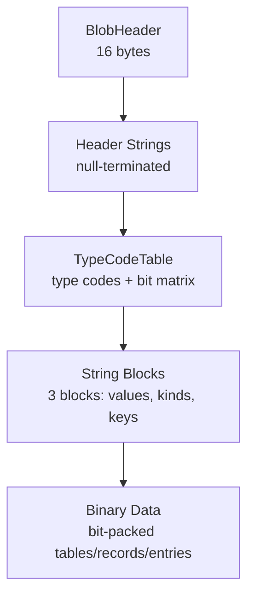

# Chapter 6: NCS Format (Nexus Config Store) {#sec-ncs-format}

Try searching BL4's pak files for item pool definitions. For loot configuration tables. For achievement data. You'll find nothing --- these classes don't exist as standard `.uasset` files. Gearbox moved critical game configuration into a custom binary format embedded directly in pak chunks, invisible to normal Unreal Engine extraction tools.

That format is NCS: Nexus Config Store. It holds item pools, drop rates, inventory part definitions, actor configurations, achievement data, and hundreds of DataTable serializations. If you want to understand how BL4's loot system works --- what can drop, where it drops, which parts are valid for which weapons --- you need to understand NCS.

This chapter is the format specification. It covers everything from Oodle-compressed pak chunks down to bit-packed tag values in the binary section. It's long, and deliberately so: NCS is a complex format with multiple encoding strategies, and the details matter when you're writing a parser.

---

## Overview

NCS stores typed configuration records. Each NCS file has a content type (`achievement`, `inv`, `itempoollist`, `loot_config`, etc.) and contains structured entries with string-valued and binary-encoded fields. The format is space-efficient --- strings are differentially encoded, values are bit-packed, and the whole thing is Oodle-compressed before being stored in a pak chunk.

The data exists at two levels:

1. **NCS Chunks** --- Oodle-compressed blocks within pak files, located via an NCS manifest
2. **Decompressed Content** --- The actual typed configuration data: header, strings, and binary section

Figure 6.1 shows the decompression pipeline. Figure 6.2 shows the layout of decompressed content.





---

## Compression

NCS data is Oodle-compressed and wrapped in a two-layer header structure. The outer header describes the NCS chunk; the inner header describes the Oodle compression format.

### Outer Header (16 bytes)

```text
Offset  Size  Type   Description
------  ----  ----   -----------
0x00    1     u8     Version (always 0x01)
0x01    3     bytes  Magic: "NCS" (0x4e 0x43 0x53)
0x04    4     u32    Compression flag (0 = raw, non-zero = Oodle)
0x08    4     u32    Decompressed size (little-endian)
0x0c    4     u32    Compressed size (little-endian)
```

The version byte has always been `0x01` in every file observed. The compression flag is zero for uncompressed data (rare) and non-zero for Oodle-compressed data (nearly all files).

### Inner Header (16+ bytes)

```text
Offset  Size  Type   Description
------  ----  ----   -----------
0x00    4     u32    Oodle magic: 0xb7756362 (big-endian)
0x04    4     bytes  Hash/checksum
0x08    4     u32    Format flags (big-endian)
0x0c    4     u32    Block count (big-endian)
```

### Format Flags

The format flags determine whether the data is stored as a single Oodle-compressed block or split across multiple blocks:

| Flags | Format | Description |
|-------|--------|-------------|
| `0x00000000` | Single-block | Small files, one Oodle block |
| `0x03030812` | Multi-block | Large files, 256KB blocks |

Single-block is the common case. Multi-block files split the decompressed data into 256KB chunks, each independently Oodle-compressed. The block count field in the inner header gives the number of chunks.

### Compatibility

Most NCS files decompress with open-source Oodle implementations. A small number (~2.4% of files) use compression parameters that require the official Oodle SDK:

| File | Size | Notes |
|------|------|-------|
| audio_event0 | ~18MB | Large audio mappings |
| coordinated_effect_filter0 | ~300KB | Effect filters |
| DialogQuietTime0 | ~20MB | Dialog timing |
| DialogStyle0 | ~370KB | Dialog styling |

---

## Content Format

After decompression, the data follows a structured binary format parsed by the `parse/` module pipeline: `blob.rs` → `typecodes.rs` → `decode.rs`.

### BlobHeader (16 bytes)

Every decompressed NCS payload starts with a 16-byte header:

```text
Offset  Size  Type   Description
------  ----  ----   -----------
0x00    4     u32    Entry count (little-endian)
0x04    4     u32    Flags
0x08    4     u32    String bytes (total size of header strings)
0x0c    4     u32    Reserved
```

### Header Strings

Immediately after the BlobHeader, `string_bytes` worth of null-terminated ASCII strings. The first string is the table type name (e.g., `achievement`, `inv`, `itempoollist`). Remaining strings are dependency table names — for `inv.bin`, these include part slot categories like `inv_comp`, `barrel`, `body`, `element`, `firmware`, etc.

### TypeCodeTable

After the header strings, the body section begins with a TypeCodeTable:

```text
Offset  Size       Description
------  ----       -----------
0x00    1          type_code_count (number of type code chars)
0x01    2          type_index_count (u16 LE)
0x03    N          type code characters (e.g., 'a', 'b', 'c', 'e', 'f', 'h', 'i', 'j', 'l')
0x03+N  ceil(type_index_count * type_code_count / 8) bytes  Bit matrix (row flags)
```

The type codes are single ASCII characters that describe the tag types used in the binary data section. Each character maps to a bit position in the row flags:

| Tag | Bit | Description |
|-----|-----|-------------|
| `a` | 0 | Key name (pair_vec string) |
| `b` | 1 | U32 value |
| `c` | 2 | F32 value |
| `d` | 3 | Name list D |
| `e` | 4 | Name list E |
| `f` | 5 | Name list F |
| `h` | 7 | Has-self-key flag (bit 7 of row flags) |
| `i` | 8 | (format-specific) |
| `j` | 9 | (format-specific) |
| `l` | 11 | (format-specific) |
| `p` | 15 | Variant (nested node) |
| `z` | — | Tag section terminator (not in bit matrix) |

The bit matrix has `type_index_count` rows and `type_code_count` columns. Each row's bits are combined into a `row_flags` u32 that determines how nodes of that type are decoded — bits 0-1 encode the node kind (null/leaf/array/map), bit 7 encodes whether the node carries its own key.

### Three String Blocks

After the bit matrix, three sequential string blocks contain the decode vocabulary:

1. **Value strings** — the actual data values referenced by index
2. **Value kinds** — type annotations (e.g., `Asset`, `game_region`, `map`)
3. **Key strings** — entry and field names (e.g., `serialindex`, `mappath`, `displayname`)

Each block has a 16-byte header: `count` (u16), `declared_count` (u16), then `byte_length` bytes of null-terminated strings.

### Binary Data Section

After the string blocks, the remaining bytes are the bit-packed binary data. This is decoded by `decode.rs` using the row flags from the TypeCodeTable and the string tables for value resolution.

The decode loop reads:
- **Table IDs** referencing header strings
- **Dependency lists** per table
- **Remap arrays** (FixedWidthIntArray) for key and value string index remapping
- **Records** with byte-aligned length prefixes
- **Tags** (a through z) per record — metadata like key names, numeric values, name lists
- **Entries** with key-value pairs decoded recursively as null/leaf/array/map nodes
- **Dependency entries** linking records to dependent tables with serial indices

---

## Binary Section

The binary section is where NCS gets complicated. It contains the actual structured data --- field values, type information, and cross-references --- in a space-efficient binary encoding. The format varies significantly across NCS file types.

### Combined String Table

Before diving into binary encodings, understand how indexing works. The binary section references strings by index into a **combined string table** built from multiple sources:

1. **Primary strings** (indices 0 to N-1) --- from the string table section
2. **Category names** (indices N to N+K-1) --- DLC identifiers like "none", "base"
3. **Field abbreviation** (next index) --- if present, like "corid_aid.a"
4. **Type name** (final index) --- the schema identifier like "achievement"

For `achievement.bin` with 10 primary strings, 3 category names, 1 abbreviation, and the type name, the combined table has 15 entries. Index 13 points to "achievement" (the type name), which serves as the `table_id`.

### Simple Binary Format (abjx)

For compact `abjx` files (like `achievement`), the binary section has this structure:

```text
Offset  Size    Description
------  ----    -----------
0x00    12      ASCII field abbreviations (e.g., 'corid_aid.a!')
0x0c    4       u32 offset/count value
0x10    4       u32 secondary value
0x14    var     Hash table or lookup data
...     var     Entry metadata (indices, flags)
...     var     Tail section with packed values
-4      4       Checksum (FNV-1a or CRC)
```

The section divider `7a 00 00 00 00 00` marks a transition point --- before it: entry data markers (`XX XX 00 00` patterns); after it: bit-packed binary data.

#### Bit-Packed String Indices

After the divider, the first ~32 bytes contain bit-packed indices into the combined string table. The bit width is determined by the table size:

- 6 strings -> 3 bits per index
- 14 strings -> 4 bits per index
- 18 strings -> 5 bits per index

Example from `achievement.bin` (4-bit indices, 14-entry table):

```text
Raw bytes: 1d 15 d7 55 e3 fb 2d fb...
Decoded:   13, 1, 5, 1, 7, 13, 5, 5, 3, 14, 11, 15...
```

Index 13 maps to "achievement" (the table_id). Index 1 maps to "10" (a field value). The bit-packed section encodes the entire entry-to-field mapping in a few dozen bytes.

#### Structured Metadata Section

Following the bit-packed indices is a byte-based metadata section. Values are mostly in the 0x08--0x30 range, with `0x28` acting as a separator between entry groups:

```text
15 11 13 14 14 14 12 25 08 08 | 28 | 13 0a 19 | 28 | 13 | 28 | 13 | 28 | 12 | 28 28 | 00 00
Entry 0: [21, 17, 19, 20, 20, 20, 18, 37, 8, 8]
Entry 1: [19, 10, 25]
Entry 2: [19]
Entry 3: [19]
Entry 4: [18]
```

The number of entry groups matches the number of entries. The `0x00 0x00` sequence terminates the section.

#### Compact Binary Format

Some NCS files (e.g., `rarity`) skip the separator-based format and use fixed-width records instead. This format is signaled by a `0x80 0x80` header after the bit-packed indices:

```text
[Bit-packed indices] [0x80 0x80] [fixed-width records] [00 00] [tail data]
```

Each entry occupies a fixed number of bytes (typically 2) without separators:

```text
rarity.bin (10 entries, 2 bytes each):
0x80 0x80 | 13 0f | 08 11 | 0d 0d | 23 08 | 08 24 | 27 11 | 0e 22 | 13 0d | 1c 1b | 26 27 | 00 00
           Entry0  Entry1  Entry2  Entry3  Entry4  Entry5  Entry6  Entry7  Entry8  Entry9  Term
```

### Extended Binary Format (abij)

Extended `abij` files (like `itempoollist`) store full field names instead of abbreviations:

```text
Offset  Size    Description
------  ----    -----------
0x00    var     Category names (none, base, basegame, ...)
var     var     Field names as null-terminated strings
var     4       u32 start marker
...     var     Hash/lookup tables
-4      4       Checksum
```

Field names section:

```text
none\0
base\0
basegame\0
pad\0
cor_dbinstance\0
structtype\0
hand\0
items\0
rowname\0
columnvalue\0
pstbms\0
```

### Tag-Based Binary Format

The most complex NCS files --- `inv.bin`, `gbxactor.bin` --- use a tag-based encoding system. Each byte in the binary section acts as a type tag that determines how to interpret the following data:

| Tag | ASCII | Type | Description |
|-----|-------|------|-------------|
| `0x61` | `a` | Pair | String reference (key-value) |
| `0x62` | `b` | U32 | 32-bit unsigned integer |
| `0x63` | `c` | U32F32 | Dual interpretation: u32 and f32 |
| `0x64`--`0x66` | `d`--`f` | List | List terminated by "none" |
| `0x68` | `h` | --- | Hash/reference |
| `0x69` | `i` | --- | Index |
| `0x6a` | `j` | --- | Jump/offset |
| `0x6c` | `l` | --- | Length-prefixed |
| `0x70` | `p` | Variant | 2-bit subtype selector |
| `0x7a` | `z` | End | Record terminator |

This format uses remap tables (FixedWidthIntArrays with 24-bit count + 8-bit width) for index compression and variable-length encoding for complex hierarchical data structures.

### Hash Function

Field names are hashed using **FNV-1a 64-bit** for lookup tables:

```rust
const OFFSET_BASIS: u64 = 0xcbf29ce484222325;
const PRIME: u64 = 0x100000001b3;

fn fnv1a_64(data: &[u8]) -> u64 {
    let mut hash = OFFSET_BASIS;
    for byte in data {
        hash ^= *byte as u64;
        hash = hash.wrapping_mul(PRIME);
    }
    hash
}
```

### Format Variations Summary

| Format | Entry Marker | Control Pattern | Field Names |
|--------|--------------|-----------------|-------------|
| `abjx` compact | `0x01` | `01 00 xx yy` | ASCII abbreviations in binary |
| `abij` extended | `0xb0` | `xx yy 01` | Full names as strings |
| `abhj` | `0xb0` | varies | Long ASCII abbreviation |
| `abcefhijl` | `0x01` | varies | Tag-based with type codes |

---

## Inventory Parts (inv.bin)

The `inv.bin` file is the **authoritative source** for valid weapon and gear parts. BL3 used explicit PartSet and PartPool assets in the pak files. BL4 moved all of that into NCS.

`inv.bin` uses the full tag-based binary format --- the most complex NCS encoding. The file is large (1.4MB decompressed, 18,393 strings, 976KB of binary data) and contains the complete inventory definition for every weapon, shield, and gear item in the game.

### File Structure

```text
Offset    Content
------    -------
0x00      BlobHeader (16 bytes)
0x10      Header strings ("inv" + 39 dependency names)
0x0d      Dependencies (39 null-terminated strings)
0x1fb     Format code ("abcefhijl")
0x225     String table (18,393 null-terminated strings)
0x169e7c  END OF FILE
```

The 39 dependency strings define valid part slot categories:

```text
inv_comp              primary_augment        secondary_augment
core_augment          barrel                 barrel_acc
body                  body_acc               foregrip
grip                  magazine               magazine_ted_thrown
magazine_acc          scope                  scope_acc
secondary_ammo        hyperion_secondary_acc payload_augment
payload               class_mod_body         passive_points
action_skill_mod      body_bolt              body_mag
element               firmware               stat_augment
body_ele              unique                 turret_weapon
tediore_acc           tediore_secondary_acc  endgame
enemy_augment         active_augment         underbarrel
underbarrel_acc_vis   underbarrel_acc        barrel_licensed
```

### Parser Pipeline

The NCS parser processes `inv.bin` through a three-stage pipeline in the `parse/` module:

1. **blob.rs** --- Reads the decompressed header: entry count, flags, string byte counts. Extracts header strings (dependencies, type name).
2. **typecodes.rs** --- Builds a `TypeCodeTable` from the format code. Reads type codes, bit matrix, and row flags. Parses 3 string blocks (value strings, value kinds, key strings) with string repair for missing null terminators.
3. **decode.rs** --- Decodes the bit-packed table data into structured output: tables, records, tags, entries, and values.

The decoder produces a `Document` containing `Table`s of `Record`s. Each record has `Tag`s (type-annotated metadata), `Entry`s (key-value data), and `DepEntry`s (dependency references with serial indices).

Serial index extraction from `inv0.bin` yields **649 of 655** known indices. The 6 missing are likely due to test data from an older game version.

### Weapon Type Definitions

Weapon types follow the pattern `{MANUFACTURER}_{WEAPONTYPE}`:

| Pattern | Example | Description |
|---------|---------|-------------|
| `DAD_PS` | Daedalus Pistol | 56 valid parts |
| `JAK_SG` | Jakobs Shotgun | Shotgun parts |
| `VLA_AR` | Vladof AR | Assault rifle parts |
| `TOR_HW` | Torgue Heavy Weapon | Heavy weapon parts |

**Manufacturers:** BOR, DAD, JAK, MAL, ORD, TED, TOR, VLA

**Weapon Types:** PS (Pistol), SG (Shotgun), AR (Assault Rifle), SM (SMG), SR (Sniper), HW (Heavy)

Parts are listed sequentially after their weapon type definition, continuing until the next weapon type entry:

```text
DAD_PS                          <- Weapon type entry
  NexusSerialized, ..., Daedalus Pistol
  Weapon_PS
  /Game/Gear/Weapons/Pistols/DAD/Body_DAD_PS.Body_DAD_PS
  ...
  DAD_PS_Barrel_01              <- Valid parts start
  DAD_PS_Barrel_01_A
  DAD_PS_Barrel_01_B
  DAD_PS_Barrel_01_C
  DAD_PS_Barrel_01_D
  DAD_PS_Body
  DAD_PS_Body_A
  DAD_PS_Body_B
  ...
  DAD_PS_Underbarrel_06         <- Last part
DAD_SG                          <- Next weapon type
```

Part names follow `{MANUFACTURER}_{WEAPONTYPE}_{SLOT}_{VARIANT}`:

- `DAD_PS_Barrel_01` --- Daedalus Pistol, Barrel slot, base variant
- `DAD_PS_Barrel_01_A` --- Daedalus Pistol, Barrel slot, A variant
- `JAK_SG_Grip_03` --- Jakobs Shotgun, Grip slot, variant 3

### Serial Index Structure

Each part has a `serialindex` field for serialization. The structure encodes both the index number and scope:

```text
serialindex: {
  status: "Active" | "Inactive"
  index: u32                // 0-127 typically
  _category: "inv_type"    // Always "inv_type" for inventory
  _scope: "Root" | "Sub"   // "Root" for item types, "Sub" for parts
}
```

**Root scope** entries identify base item types (e.g., `DAD_PS`, `BOR_SG`). In serialized items, Root indices occupy the range 0--127 (bit 7 = 0).

**Sub scope** entries identify individual parts within an item type. Indices are unique within each type but may repeat across types. In serialized items, Sub indices use 128--255 (bit 7 = 1).

#### Bit 7 Flag

In actual serialized items, the Root vs Sub distinction is encoded as bit 7 of the part token index:

```text
For Part indices > 142 (beyond element range):
  Bit 7 = 0 -> Root scope (core parts: body, barrel, scope)
  Bit 7 = 1 -> Sub scope (attachments: grips, foregrips, underbarrel)

Actual part index = serial_index & 0x7F  (strip bit 7)
```

Examples from Rainbow Vomit (Jakobs Shotgun):

- Serial index 4 -> `part_body_b` (Root, bit 7 = 0)
- Serial index 170 -> 42 -> `part_grip_03` (Sub, bit 7 = 1, actual = 42)
- Serial index 166 -> 38 -> `part_grip_04_hyp` (Sub, bit 7 = 1, actual = 38)

The NCS `_scope` field directly corresponds to how parts are encoded in serialized items.

### Legendary Compositions

Legendary weapons are defined by `comp_05_legendary_*` entries with mandatory parts:

```text
comp_05_legendary_Zipgun
  uni_zipper                    <- Unique naming part (red text)
  part_barrel_01_Zipgun         <- Mandatory unique barrel

comp_05_legendary_DiscJockey
  uni_discjockey
  part_barrel_02_DiscJockey

comp_05_legendary_OM            <- Oscar Mike
  part_barrel_unique_OM

comp_05_legendary_GoreMaster
  part_barrel_02_GoreMaster
```

Each composition has: an identifier (`comp_05_legendary_{name}`), a unique naming part (`uni_{name}`) that provides the display name and red text, and one or more mandatory parts (usually a unique barrel).

### NCS vs Memory Part Names

Part names differ between NCS extraction and runtime memory dumps:

| NCS Name | Memory Name |
|----------|-------------|
| `DAD_PS_Barrel_01` | `DAD_PS.part_barrel_01` |
| `DAD_PS_Body_A` | `DAD_PS.part_body_a` |
| `DAD_PS_Grip_04` | `DAD_PS.part_grip_04_hyp` |

NCS consistently has more parts (56 for `DAD_PS`) than memory extraction (34), because memory dumps only capture parts that exist as runtime UObjects during the dump. Always use NCS as the authoritative source.

### Extracting Parts

```bash
# Extract all item parts (weapons + shields) to JSON
bl4 ncs extract inv4.bin -t item-parts --json -o item_parts.json

# View weapon parts for a specific pakchunk
bl4 ncs extract /path/to/ncsdata/pakchunk4-Windows_0_P -t item-parts
```

Output:

```json
[
  {
    "item_id": "DAD_PS",
    "parts": ["DAD_PS_Barrel_01", "DAD_PS_Barrel_01_A", "..."],
    "legendary_compositions": ["..."]
  },
  {
    "item_id": "Armor_Shield",
    "parts": ["part_core_atl_protractor", "part_ra_armor_segment_primary", "..."],
    "legendary_compositions": []
  }
]
```

---

## Actor Definitions (gbxactor.bin)

The `gbxactor.bin` file defines game actors: characters, AI behaviors, abilities, teams, and spawn patterns. It uses the `abef` format code with approximately 1,740 entries.

### Entry Categories

| Category | Pattern | Description |
|----------|---------|-------------|
| `Actor_*` | `Actor_PLD_AS_Scourge_*` | Player abilities, projectiles |
| `Char_AI` | `Char_AI` | Base AI character definition |
| `Char_Enemy` | `Char_Enemy` | Base enemy character |
| `Char_NPC` | `Char_NPC` | Base NPC character |
| `Char_{Type}` | `Char_Paladin`, `Char_ExoSoldier` | Player character types |
| `Char_{Enemy}` | `Char_ArmyBandit_*`, `Char_Psycho*` | Enemy types |
| `Char_Gadget_*` | `Char_Gadget_AutoTurret_Base` | Gadget/turret actors |
| `Team_*` | `Team_Player`, `Team_Bandit` | Team definitions |
| `MPart_*` | `MPartRand_Skin_Human` | Mesh part randomizers |

Characters inherit from base types:

```text
Char_AI
+-- Char_Enemy
|   +-- Char_ArmyBandit_SHARED
|   +-- Char_PsychoBasic
|   +-- ...
+-- Char_NPC
+-- Char_Gadget_AutoTurret_Base
```

Actor entries define behavior properties like `PatrolPauseTime`, `bCanEngagePlayers`, `Element` (NoElement, Corrosive, Cryo, Fire, Shock, Radiation), and spawn patterns. Weapon parts are *not* in `gbxactor.bin` --- those are exclusively in `inv.bin`.

---

## Entity Display Names (NameData)

NCS files contain `NameData_*` entries that map internal type names to in-game display names. Each entry follows the pattern:

```text
NameData_<InternalType>, <UUID>, <DisplayName>
```

### Boss Names

| Internal Type | UUID | Display Name |
|---------------|------|--------------|
| `NameData_Meathead` | `D342D6EE47173677CE1C068BADA88F69` | Saddleback |
| `NameData_Meathead` | `B8EAFB724DAB6362B39A5592718B54B0` | The Immortal Boneface |
| `NameData_Meathead` | `33D8546645185A85D4575F984C7DC44B` | Saddleback & Boneface |
| `NameData_Meathead` | `B632671F4B8F70E97E878BA8CFEEC00B` | Big Encore Saddleback |

### Enemy Variants

Enemies have elemental and rank variants, each with a unique UUID:

```text
NameData_Thresher, 35D7CBFD4E844BB1624140B84DE69546, Vile Thresher
NameData_Thresher, 7505A0A34FC98F3916DABBA70974675F, Badass Thresher
NameData_Thresher, 4829F4F643423CB6F1F144B4F5A2F2CB, Burning Badass Thresher
NameData_Thresher, 2A0DEEE34653F2E0BD3C8BABC4D1353D, Boreal Badass Thresher

NameData_Bat, 160168F945945478127AD496A3BB0673, Badass Kratch
NameData_Bat, 52A45B3F42B1A9480C36188401A6C801, Vile Kratch
NameData_Bat, 05E8994641C36AF561B109ACD197D81D, Airstrike Kratch
```

### Boss Replay and Challenge Text

`Table_BossReplay_Costs` entries reference boss display names with location context:

```text
Table_BossReplay_Costs, 2DCA8E674F8F83E700B52B959C65C2D2, Meathead Riders: Saddleback, The Immortal Boneface
```

UVH challenge strings embed boss names with their locations:

```text
UVH_Rankup_2_Challenges, ..., Kill Bramblesong in UVH 1 (Abandoned Auger Mine, Stoneblood Forest, Terminus Range).
UVH_Rankup_2_Challenges, ..., Kill Bio-Thresher Omega in UVH 1 (Fades District, Dominion).
UVH_Rankup_4_Challenges, ..., Kill Mimicron in UVH 3 (Order Bunker, Idolator's Noose, Fadefields).
```

### Internal to Display Name Mapping

Known boss translations from `itempoollist` internal names to `NameData` display names:

| Internal Name (itempoollist) | Display Name (NameData) |
|------------------------------|-------------------------|
| `MeatheadRider_Jockey` | Saddleback |
| `Thresher_BioArmoredBig` | Bio-Thresher Omega |
| `Timekeeper_Guardian` | Guardian Timekeeper |
| `BatMatriarch` | Skyspanner Kratch |
| `TrashThresher` | Sludgemaw |
| `StrikerSplitter` | Mimicron |
| `Destroyer` | Bramblesong |

### Extracting NameData

```bash
# Get all NameData entries
strings /path/to/ncs_native/*/*.bin | grep "^NameData_" | sort -u

# Get specific boss type mappings
strings /path/to/ncs_native/*/*.bin | grep "^NameData_Meathead"

# Get challenge text with boss names
strings /path/to/ncs_native/*/*.bin | grep "UVH.*Kill"
```

---

## NCS Manifest

Each pak file contains an NCS manifest at the `_NCS/` path. The manifest lists every NCS chunk in the pak and provides the index needed to locate each chunk.

### Manifest Header

```text
Offset  Size  Type   Description
------  ----  ----   -----------
0x00    5     bytes  Magic: "_NCS/" (0x5f 0x4e 0x43 0x53 0x2f)
0x05    1     u8     Null terminator
0x06    2     u16    Entry count (little-endian)
0x08    2     u16    Unknown (typically 0x0000)
0x0a    var   Entry  Entry records
```

### Manifest Entry

```text
length (u32) | filename (length-1 bytes) | null (u8) | index (u32)
```

Sort entries by index to get the correct order matching NCS chunk offsets in the pak file.

---

## DataTable Relationship

NCS files contain serialized DataTable rows that reference schemas in `.uasset` files. The GUID portion of a schema name matches across both formats:

**Schema file** (`Struct_DedicatedDropProbability.uasset`):

```json
{
  "name": "Primary_2_A7EABE6349CCFEA454C199BC8C113D94",
  "value_type": "Double",
  "float_value": 0.0
}
```

**NCS reference:**

```text
Table_DedicatedDropProbability
Prim2_A7EABE6349CCFEA454C199BC8C113D94
```

Numeric values (weights, probabilities) are stored as strings in NCS: `"0.200000"`, `"1.500000"`. The binary section's bit-packed indices point into the string table where these values live.

---

## Known File Types

| Type | Description | Count |
|------|-------------|-------|
| `achievement` | Achievement definitions | 1 |
| `aim_assist_parameters` | Aim assist config | 1 |
| `ainodefollowsettings` | AI follow settings | 1 |
| `ainodeLeadsettings` | AI lead settings | 1 |
| `attribute` | Game attributes | ~10 |
| `audio_event` | Audio event mappings | 1 |
| `coordinated_effect_filter` | Effect filters | 1 |
| `gbx_ue_data_table` | Gearbox data tables | many |
| `gbxactor` | Actor definitions | 1 |
| `inv` | Inventory part definitions | 1 |
| `itempool` | Item pool definitions | many |
| `itempoollist` | Item pool lists (boss drops) | many |
| `loot_config` | Loot configuration | many |
| `Mission` | Mission data | many |
| `preferredparts` | Part preferences | 1 |
| `trait_pool` | Trait pool definitions | many |
| `vending_machine` | Vending inventory | many |

### Key Files for Loot Analysis

| File | Purpose |
|------|---------|
| `itempoollist.bin` | Boss-to-legendary mappings. `ItemPoolList_<BossName>` records with dedicated drops. |
| `itempool.bin` | General item pools: rarity weights, world drops, Black Market items. |
| `loot_config.bin` | Global loot configuration parameters. |
| `preferredparts.bin` | Part preferences for weapon/gear generation. |
| `inv.bin` | Complete inventory definitions: parts, compositions, serial indices. |

### Extracting Drop Information

```bash
# Generate drops manifest from NCS data
bl4 drops generate "/path/to/ncs_native" -o share/manifest/drops.json --manifest-dir share/manifest

# Find where an item drops
bl4 drops find hellwalker

# List drops from a specific boss
bl4 drops source Timekeeper
```

See [Appendix C: Loot System Internals](#sec-loot-system) for detailed drop table documentation.

---

## Type Prefixes

Some string table values carry single-letter type prefixes:

| Prefix | Type | Example |
|--------|------|---------|
| `T` | Text/String | `Tnone` = string "none" |
| `b` | Base/Boolean | context-dependent |
| `F` | Float | context-dependent |

---

## Worked Example: achievement.bin

To tie the format together, here's a complete walkthrough of `achievement.bin` (278 bytes decompressed).

### File Layout

```text
0x000-0x008 (  8 bytes): Header
0x009-0x015 ( 12 bytes): Type name: 'achievement'
0x015-0x01c (  7 bytes): Format: 03 03 00 abjx
0x01c-0x01f (  3 bytes): Entry marker + field info: 01 0a c2
0x01f-0x073 ( 84 bytes): String table (entries + values)
0x073-0x077 (  4 bytes): Control section: 01 00 0b e9
0x077-0x08a ( 19 bytes): Category names: none, base, basegame
0x08a-0x116 (140 bytes): Binary data section
```

### String Table Contents

| Offset | String | Purpose |
|--------|--------|---------|
| 0x1f | `ID_A_10_worldevents_colosseum` | Entry 1 name |
| 0x3d | `10` | Entry 1 achievementid |
| 0x40 | `1airship` | Entry 2 differential |
| 0x49 | `11` | Entry 2 achievementid |
| 0x4c | `2meteor` | Entry 3 differential |
| 0x54 | `1224_missions_side` | Entry 3+4 packed |
| 0x67 | `24` | Entry 4 achievementid |
| 0x6a | `9main` | Entry 5 differential |
| 0x70 | `29` | Entry 5 achievementid |

### Parsed Output

```json
{
  "achievement": {
    "records": [{
      "entries": [
        {
          "id_achievement_10_worldevents_colosseum": {
            "achievement": "ID_Achievement_10_worldevents_colosseum",
            "achievementid": "10"
          }
        },
        {
          "id_achievement_11_worldevents_airship": {
            "achievement": "ID_Achievement_11_worldevents_airship",
            "achievementid": "11"
          }
        },
        {
          "id_achievement_12_worldevents_meteor": {
            "achievement": "ID_Achievement_12_worldevents_meteor",
            "achievementid": "12"
          }
        },
        {
          "id_achievement_24_missions_side": {
            "achievement": "ID_Achievement_24_missions_side",
            "achievementid": "24"
          }
        },
        {
          "id_achievement_29_missions_main": {
            "achievement": "ID_Achievement_29_missions_main",
            "achievementid": "29"
          }
        }
      ]
    }]
  }
}
```

---

## Compatibility Issues

### Oodle SDK Requirements

The four files listed in the Compression section (~2.4% of all NCS files) fail to decompress with open-source Oodle implementations. They require the official Oodle SDK. All other NCS files decompress correctly with open-source tools.

### String Validation

When parsing the string table, valid strings should be at least 2 characters long and contain no garbage characters. Pure numeric strings (`"10"`, `"24"`) are valid. Short strings (2--3 characters) should be all lowercase or known keywords.

Watch for these invalid patterns:

- Mixed-case short strings like `"zR"` or `"D3"` --- binary data misinterpreted as text
- Trailing or leading spaces
- High underscore-to-letter ratio

---

## Future Work

Several areas of the format remain partially understood:

1. **Hash table decoding** --- The u32 values after ASCII field abbreviations likely form a hash lookup table, but the exact structure isn't confirmed.
2. **Entry-to-category mapping** --- How the binary section maps entries to their DLC categories.
3. **Cross-file references** --- How NCS files reference each other (e.g., ItemPool entries pointing to ItemPoolList records).
4. **Runtime behavior** --- How the game engine loads and indexes NCS data at runtime.
5. **Structured section encoding** --- For `inv.bin`, the 107 bit-packed indices in the first entry map to 16 JSON fields, but the exact mapping algorithm isn't fully decoded.
6. **Format code semantics** --- The format code letters (`abcehijl`) clearly correspond to tag types, but the full specification for each letter's encoding rules is still being worked out.
7. **Inline entry names** --- The `CAaB`/`RQJ`/`IEZ` identifiers in `inv.bin`'s metadata section are parsed but their semantic meaning is unclear.

---

The NCS format is approximately 95% reverse-engineered. The compression layer, string tables, differential encoding, and tag-based binary section are all well understood and implemented in the `bl4-ncs` parser. The remaining unknowns are in the binary section's finer details --- hash table structures, cross-file reference resolution, and the exact semantics of per-entry schema encoding. [Chapter 7](#sec-data-extraction) covers how to extract usable game data from these parsed NCS documents.
